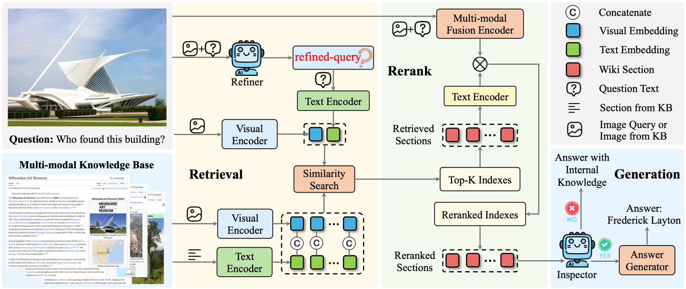

<p align="center">
  
</p>

# WikiSeeker: Rethinking the Role of Vision-Language Models in Knowledge-Based Visual Question Answering

[](https://arxiv.org/abs/2604.05818)
[](https://2026.aclweb.org/)
[](https://github.com/zhuyjan/WikiSeeker/stargazers)
[](https://opensource.org/licenses/Apache-2.0)

## Overview
<p align="center"></p>

We introduce WikiSeeker, a novel multi-modal RAG framework that bridges these gaps by proposing a multi-modal retriever and redefining the role of VLMs. Rather than serving merely as answer generators, we assign VLMs two specialized agents: a Refiner and an Inspector. The Refiner utilizes the capability of VLMs to rewrite the textual query according to the input image, significantly improving the performance of the multimodal retriever. The Inspector facilitates a decoupled generation strategy by selectively routing reliable retrieved context to another LLM for answer generation, while relying on the VLM’s internal knowledge when retrieval is unreliable.

## 🎯 Todo List
- [x] Release paper on Arxiv.
- [x] Publish the details of dataset processing.
- [x] Release the multi-modal retrieval code along with the corresponding knowledge base.
- [ ] Release the RL training code for Refiner.

## Data Preparation

You can refer to the [EchoSight](https://github.com/Go2Heart/EchoSight) VQA Questions section for preparing the EVQA and InfoSeek datasets. However, note the following important points:

1. When downloading the [iNaturalist 2021](https://github.com/visipedia/inat_comp/tree/master/2021) images, ensure you download the **train set (224GB)** and **val set (8.4GB)** for training and testing purposes, respectively.
2. Following the [OMGM](https://github.com/ChaoLinAViy/OMGM) procedure, all images from the iNaturalist train and val sets have been reconstructed and converted to the `id.jpg` format, all stored in a single path (eliminating the need for `id2name` mapping).
3. For the [Google Landmarks Dataset V2](https://github.com/cvdfoundation/google-landmark), ensure you download the **train set** (499 tar files), **not the test set** mistakenly mentioned in the EchoSight documentation.
4. As for the [oven_images](https://huggingface.co/datasets/ychenNLP/oven/tree/main), decompress the 8 tar files and consolidate all images into the `oven_imgs` directory.

After setting up all datasets, please update the respective dataset paths in `utils/utils.py`.

## Launch Retriever Service 
You can download the necessary multi-modal kb `eva_qwen3_faiss_index` from our [HF Repo](https://huggingface.co/datasets/i2plus/WikiSeeker-Data/tree/main) to start the service.
```
bash scripts/start_retriever_service.sh
```

## Multi-modal Retrieval
```
bash scripts/run_retrieval.sh
```

## 📚 Citation
If you find our work useful, please give us a star 🌟 and use the following BibTeX entry for citation.
```
@article{zhu2026wikiseeker,
  title={WikiSeeker: Rethinking the Role of Vision-Language Models in Knowledge-Based Visual Question Answering},
  author={Zhu, Yingjian and Wang, Xinming and Ding, Kun and Wang, Ying and Fan, Bin and Xiang, Shiming},
  journal={arXiv preprint arXiv:2604.05818},
  year={2026}
}
```

## Acknowledgements
Our code is built upon [EchoSight](https://github.com/Go2Heart/EchoSight), [OMGM](https://github.com/ChaoLinAViy/OMGM) and [DeepRetrieval](https://github.com/pat-jj/DeepRetrieval). Thanks for their great work.
